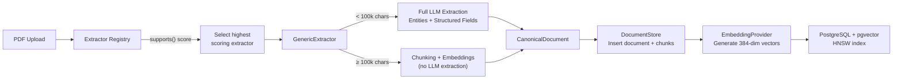
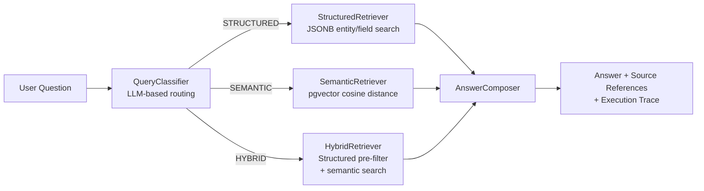
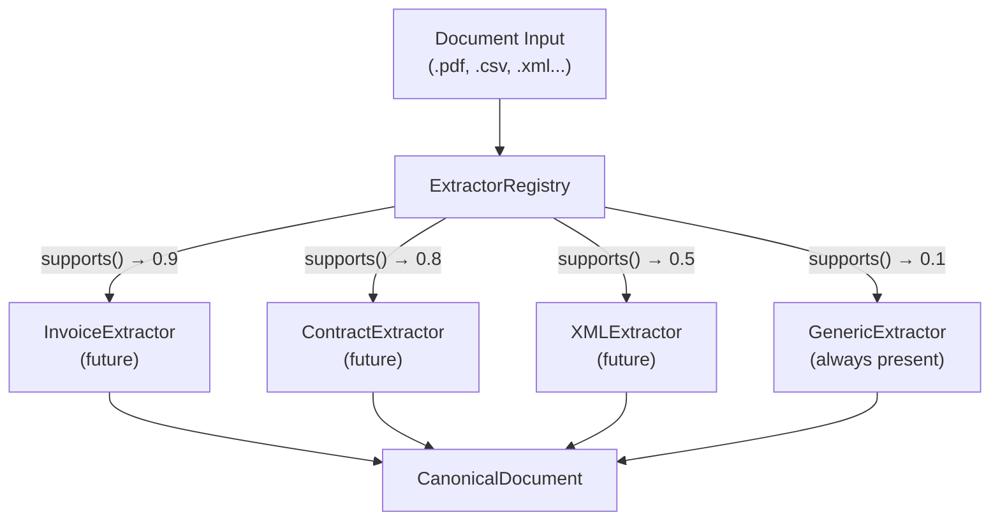

# Architecture

## System Overview

```
                                ┌──────────────────┐
                                │   User (Browser)  │
                                └────────┬─────────┘
                                         │
                                         ▼
                                ┌──────────────────┐
                                │   Next.js (:3000) │
                                │   Single-page app │
                                └────────┬─────────┘
                                         │ /api/* proxy
                                         ▼
                                ┌──────────────────┐
                                │  FastAPI (:8000)  │
                                │   CORS: *         │
                                └──┬───────┬───────┘
                                   │       │
                    ┌──────────────┤       ├──────────────┐
                    ▼              ▼       ▼              ▼
          ┌─────────────┐  ┌───────────┐  ┌──────────┐  ┌─────────────┐
          │ PostgreSQL   │  │   LLM     │  │Embedding │  │  Extractor  │
          │ + pgvector   │  │ Provider  │  │ Provider │  │  Registry   │
          │  (pg16)      │  │           │  │          │  │  (plugin)   │
          └─────────────┘  └───────────┘  └──────────┘  └─────────────┘
```

The system is a modular monolith. Three Docker containers (db, backend, frontend) form a single cohesive application. The frontend proxies `/api/*` requests to the backend; file uploads bypass the proxy and go directly to the backend to avoid memory issues with large files.

---

## Ingestion Pipeline



### Flow

1. **Upload** — A PDF arrives via `POST /documents/upload`.
2. **Registry selection** — The `ExtractorRegistry` iterates registered extractors. Each returns a confidence score via `supports()`. The highest-scoring extractor is selected.
3. **Extraction** — `GenericExtractor.extract()` reads the PDF text via `pypdf`, creates a `CanonicalDocument`, and branches by size:
   - **Small documents** (< 100,000 chars): Full LLM extraction — entities, relationships, structured fields.
   - **Large documents** (≥ 100,000 chars): Chunking only (500 char chunks, 50 char overlap). No expensive LLM extraction.
4. **Persistence** — The canonical document and its chunks are saved to PostgreSQL via `DocumentStore`.
5. **Embedding** — Each chunk is embedded via `EmbeddingProvider` (FastEmbed, 384-dim BGE vectors) and stored in a `Vector(384)` column with an HNSW index for fast ANN search.

---

## Query Pipeline



### Flow

1. **Contextualization (follow-ups only)** — `QueryContextualizer` rewrites implicit follow-ups (e.g., "give me top 5 points") into standalone questions using the previous answer.
2. **Classification** — `QueryClassifier` uses an LLM to categorize the question as `STRUCTURED`, `SEMANTIC`, or `HYBRID`. Falls back to `SEMANTIC` for unrecognized outputs.
3. **Routing** — `QueryPlanner.execute()` dispatches to the appropriate retriever:
    - **STRUCTURED**: `StructuredRetriever` queries `DocumentModel` using SQLAlchemy JSONB containment operators on `entities` and `structured_fields`.
    - **SEMANTIC**: `SemanticRetriever` embeds the query and runs a pgvector cosine distance search (< 0.8 threshold) against chunk embeddings.
    - **HYBRID**: `HybridRetriever` first runs structured pre-filtering (limit 50), then semantic search over the filtered subset.
4. **Composition** — `AnswerComposer` builds the final response:
    - **Structured answers**: Direct formatting from database results. No LLM involved for deterministic facts.
    - **Semantic/hybrid answers**: LLM synthesis from retrieved context, with source references.
5. **Response** — Every answer includes a `ComposedAnswer` with the answer text, source references (document-name chips that open the knowledge graph), and execution trace (strategy, steps, result counts).

### How QueryClassifier Works

The classifier sends an LLM prompt with:
- **Category rules** — Clear definitions of when to use STRUCTURED (lookup), SEMANTIC (synthesis), or HYBRID (both)
- **Filter extraction** — Instructions to identify `document_type`, `field_filters`, and `entity_name` from the question
- **Few-shot examples** — Concrete examples like "What is Akshit email?" → STRUCTURED, "Summarize work experience" → SEMANTIC, "What did this person do at CRED?" → HYBRID
- **JSON output** — The LLM returns structured JSON; the classifier parses it into a `ClassificationResult` dataclass
- **Fallback** — If JSON parsing fails, defaults to SEMANTIC (safest choice for open-ended questions)

The prompt is ~60 lines with explicit rules and examples. Temperature is 0.0 for deterministic classification.

### Chat & Multi-turn Context

The chat endpoint (`POST /query/chat/stream`) maintains an in-memory session:

1. The frontend sends the full message history.
2. If prior turns exist, `QueryContextualizer` rewrites the latest follow-up into a standalone question, resolving pronouns and implicit references.
3. The rewritten question is routed through `QueryPlanner` and `AnswerComposer` as usual.
4. The backend streams SSE events: `progress` → `meta` → `contextualize` → `trace` → `sources` → `token*` → `done`.
5. The `progress` events give the user coarse feedback: "Understanding your question...", "Searching your documents and knowledge graph...", "Synthesizing the answer...".

Chat history is session-only. A page refresh clears it by design.

### How AnswerComposer Works

Three different prompt strategies based on retrieval type:

**Structured answers** (`_compose_structured`):
- Single document: Sends structured fields as JSON, asks LLM to extract the specific value requested
- Multiple documents: Direct formatting — "Found N matching documents: [list]"
- No LLM hallucination risk for deterministic facts

**Semantic answers** (`_compose_semantic`):
- Builds context from retrieved chunks with page numbers
- Prompt enforces: "Answer using ONLY the provided excerpts"
- Includes refusal handling: "If the answer is truly not in the excerpts, say 'The documents do not contain enough information'"
- Special handling for date/duration questions: "Examine ALL excerpts for start and end dates, then calculate the total span"
- Max 1500 tokens for thorough answers

**Hybrid answers** (`_compose_hybrid`):
- Combines structured data (key-value pairs) with semantic context (chunk excerpts)
- Prompt: "Answer using ONLY the provided structured data and document excerpts"
- Max 1500 tokens, concise factual answers

### How Retrievers Work

**StructuredRetriever** (algorithmic, no LLM):
- Builds SQLAlchemy queries with JSONB containment operators
- `field_filters` → `structured_fields.contains({key: value})`
- `entity_name` → `entities.contains([{"name": entity_name}])`
- Returns up to 20 matching documents

**SemanticRetriever** (algorithmic, no LLM):
- Embeds the query using FastEmbed (384-dim BGE vector)
- Runs pgvector cosine distance search: `embedding <=> query_embedding < 0.8`
- HNSW index for fast approximate nearest neighbor search
- Returns up to 10 most similar chunks

**HybridRetriever** (algorithmic, no LLM):
- Runs structured pre-filter (limit 50 documents)
- Runs semantic search (limit 5 chunks)
- Returns both result sets; AnswerComposer merges them

---

## Plugin Architecture



### Interface

Every extractor implements:

```python
class Extractor(ABC):
    def supports(self, document: DocumentInput) -> float: ...
    async def extract(self, document: DocumentInput) -> CanonicalDocument: ...
```

- `supports()` returns a confidence score (0.0–1.0). The registry selects the highest-scoring extractor.
- `extract()` produces a `CanonicalDocument` — a unified schema that all downstream modules consume.
- `GenericExtractor` scores `0.1` for PDFs and acts as the fallback. It's always present in the registry.

### Adding an Extractor

1. Create a class inheriting from `Extractor`.
2. Implement `supports()` and `extract()`.
3. Add it to `create_default_registry()`.

The rest of the pipeline — ingestion, storage, embeddings, query — does not change.

---

## Key Design Decisions

- **CanonicalDocument** — All extractors output the same schema. No downstream module depends on document-specific structures.
- **Extractor registry** — Plugin-based. Adding a new document type requires only a new extractor class.
- **Query classification** — LLM-driven routing into structured/semantic/hybrid paths. Deterministic questions get deterministic answers.
- **No fabricated confidence scores** — Answers include source references and execution traces. Trust comes from evidence.
- **Modular monolith** — Three containers, one cohesive application. No microservices, message queues, or distributed coordination.
