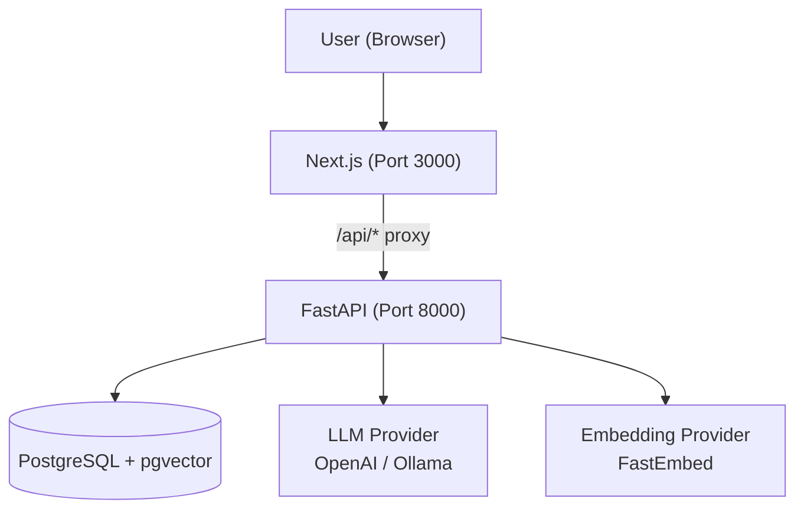
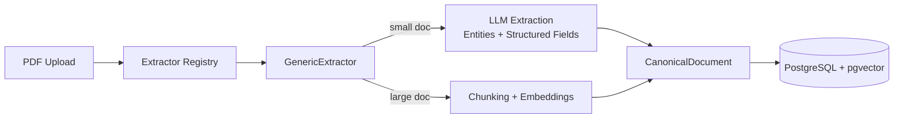
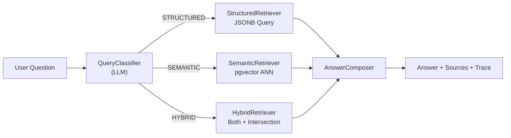
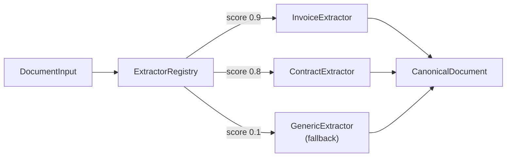

# Phase 12: Final Polish

## Objective

Make the repository reviewer-ready. Complete documentation, architecture diagrams, tradeoff analysis, and seed data so a reviewer can clone, build, and understand the system within fifteen minutes. No code changes except documentation files.

## Context

- **Phases 1–11** built and stabilized the complete application. Phase 11 confirmed zero type errors, zero lint issues, all tests passing, Docker startup clean, and manual smoke test passing.
- **The repository currently has** minimal documentation. `AGENTS.md` and `ENGINEERING_PRINCIPLES.md` exist but are agent-facing, not reviewer-facing.
- **PROJECT_SPEC.md** describes the vision but not how to run the system.
- **Legacy files** (`eval_pipeline.py`, `agent_graph.py`, `ingest_and_search.py`) exist but are not explained to the reviewer.
- **Sample PDF** (`sample_technical_document.pdf`) exists in the root but is not referenced in any user-facing docs.
- **Per AGENTS.md**, a reviewer should be able to: clone, copy `.env`, run `docker compose up --build`, use the app, understand architecture in 5 minutes, and recognize tradeoffs.

## Scope

### In Scope

- `README.md` — setup, architecture, API, testing
- `ARCHITECTURE.md` — system design with Mermaid diagrams
- `docs/TRADEOFFS.md` — key engineering decisions and alternatives rejected
- `docs/CONTRIBUTING.md` — how to add extractors, providers, retrievers
- Verify Docker startup with clean state
- Verify seed document works for immediate exploration
- Cross-reference all docs against actual code
- Update `.env.example` if any required vars are missing

### Out of Scope

- Code changes (if bugs found, fix in Phase 11 first)
- New features or API endpoints
- Performance benchmarks
- CI/CD configuration

---

## 1. README.md

The README is the single most important file for the reviewer. It must be scannable in 2 minutes and complete enough to answer all setup questions.

### Structure

```markdown
# Document Intelligence Platform

> Universal document intelligence with structured and semantic retrieval.
> Not just "chat with PDF".

## Quick Start

```bash
cp .env.example .env
# Edit .env with your OPENAI_API_KEY (optional — Ollama works too)
docker compose up --build
```

Open http://localhost:3000

## What It Does

1. Upload a PDF
2. System extracts text, chunks it, generates embeddings
3. Ask questions in natural language
4. Receive answers with source references and execution trace

## Architecture

[Mermaid diagram: high-level system]

## Key Features

- **Structured Retrieval:** Deterministic queries against JSONB (totals, counts, filters)
- **Semantic Retrieval:** Vector search via pgvector + FastEmbed
- **Hybrid Retrieval:** Combine structured filters with semantic search
- **Explainable Answers:** Every response includes sources, page refs, and execution trace
- **Plugin Extractors:** Add new document types without touching the pipeline
- **LLM Provider Abstraction:** Swap OpenAI ↔ Ollama without code changes

## API

```bash
# Upload
curl -X POST -F "file=@sample.pdf" http://localhost:8000/documents/upload

# Query
curl -X POST -H "Content-Type: application/json" \
  -d '{"query":"What is the total amount?"}' \
  http://localhost:8000/query
```

## Testing

```bash
cd backend
.venv/bin/python -m pytest ../tests/ -v
```

## Tech Stack

- Frontend: Next.js 15.1, TypeScript, Tailwind
- Backend: FastAPI, Python 3.11, Pydantic, SQLAlchemy
- Database: PostgreSQL 16 + pgvector
- Embeddings: FastEmbed (BAAI/bge-small-en-v1.5)
- LLM: OpenAI-compatible APIs or Ollama
- Evaluation: RAGAS (Faithfulness, Context Precision)

## Project Structure

```
backend/          FastAPI application
frontend/         Next.js application
docs/             Architecture & tradeoff documentation
tests/            Backend test suite
docker-compose.yml
```

## License

MIT
```

### Rationale

The README leads with a Quick Start because that's what the reviewer does first. Architecture comes next so they understand what they're looking at. API examples let them test without opening the UI. Project Structure orients them in the codebase.

---

## 2. Architecture Diagrams

### 2.1 Location

`docs/ARCHITECTURE.md`

### 2.2 Diagram 1: High-Level System (Mermaid)



### 2.3 Diagram 2: Ingestion Pipeline (Mermaid)



### 2.4 Diagram 3: Query Pipeline (Mermaid)



### 2.5 Diagram 4: Plugin Architecture (Mermaid)



**Rationale:** Mermaid diagrams render natively in GitHub markdown. No external tools needed. Four diagrams cover system overview, ingestion, query, and extensibility — the four things a reviewer needs to understand.

---

## 3. Tradeoff Documentation

### 3.1 Location

`docs/TRADEOFFS.md`

### 3.2 Required Sections

Each tradeoff follows this template:

```markdown
### [Decision Name]

**What we chose:** [specific approach]

**Why:** [2-3 sentences]

**What we rejected:** [specific alternatives]

**Consequences:** [what this enables and what it limits]
```

### 3.3 Tradeoffs to Document

| # | Tradeoff | Chosen | Rejected |
|---|----------|--------|----------|
| 1 | Architecture | Modular monolith (single backend) | Microservices, Kafka, Kubernetes |
| 2 | Vector Store | PostgreSQL + pgvector (persistent) | Qdrant in-memory (original codebase) |
| 3 | Embeddings | FastEmbed (local, free, 384-dim) | OpenAI Embeddings API (cost, latency) |
| 4 | Structured Answers | Direct formatting (no LLM) | LLM narration of deterministic facts |
| 5 | Query Classification | LLM prompt-based classifier | Rule-based regex classifier |
| 6 | Frontend | Single-page Next.js app | Multi-page app with complex routing |
| 7 | File Uploads | Direct to backend (bypass Next.js proxy) | Through Next.js API routes |
| 8 | Evaluation | RAGAS with local judge (Ollama) | Human evaluation, proprietary benchmarks |
| 9 | Extraction | GenericExtractor with size threshold | Always full-document LLM extraction |
| 10 | Schema | CanonicalDocument (unified) | Per-document-type schemas |

**Rationale:** The AGENTS.md Golden Rule says to "choose the solution that is easier to explain." Documenting tradeoffs proves the engineer thought through alternatives. A reviewer reading `TRADEOFFS.md` should think "this person made intentional choices, not accidental ones."

---

## 4. Contributing Guide

### 4.1 Location

`docs/CONTRIBUTING.md`

### 4.2 Content

Brief guide for extending the system:

```markdown
# Contributing

## Adding a New Extractor

1. Create `backend/extractors/my_extractor.py`
2. Inherit from `extractors.base.Extractor`
3. Implement `supports(document)` → float score
4. Implement `extract(document)` → `CanonicalDocument`
5. Register in `extractors.registry.create_default_registry()`

## Adding a New LLM Provider

1. Create `backend/llm/my_provider.py`
2. Inherit from `llm.base.LLMProvider`
3. Implement `complete(prompt)` → str
4. Register in `llm.factory.create_llm_provider()`

## Adding a New Retrieval Strategy

1. Create `backend/query/my_retriever.py`
2. Wire into `query.planner.QueryPlanner`
```

**Rationale:** Demonstrates the plugin architecture is real and not just theoretical. Shows the Open-Closed Principle in practice.

---

## 5. Seed Documents

### 5.1 Goal

A reviewer should be able to test the system immediately without finding their own PDF.

### 5.2 Plan

The existing `sample_technical_document.pdf` (8.4 MB, 1 page, scanned/image-dominant from Phase 1 audit) is already in the repository root.

**Action items:**
1. Verify `sample_technical_document.pdf` exists in repo root
2. Add a note in README: "Use `sample_technical_document.pdf` in the repo root for quick testing"
3. Document known limitation: "This sample PDF is image-dominant; text extraction may be limited. For best results, use a text-based PDF."
4. Do NOT auto-process seed documents on startup — that would require backend logic changes and slow Docker startup

**Rationale:** Auto-seeding would require:
- A startup script in `backend/main.py` or a separate container
- Waiting for FastEmbed model download (~130MB, ~30s on first run)
- Error handling if the LLM provider isn't configured

This is too complex for Phase 12. Manual upload with clear instructions is sufficient.

---

## 6. Docker Validation

### 6.1 Clean-Slate Test

```bash
docker compose down -v
docker compose up --build
```

### 6.2 Verification Checklist

- [ ] All three services start without error
- [ ] Backend `/health` returns `{"status":"ok"}`
- [ ] Backend `/health/db` returns database connected
- [ ] Frontend `http://localhost:3000` loads
- [ ] Upload `sample_technical_document.pdf` succeeds
- [ ] Query interface returns a response (even if limited text extraction)
- [ ] No JavaScript errors in browser console
- [ ] No Python exceptions in `docker compose logs backend`
- [ ] `docker compose down && docker compose up` (without `--build`) also works

### 6.3 .env Validation

Verify `.env.example` contains all required variables:

```bash
# Required
DATABASE_URL=postgresql+asyncpg://postgres:postgres@db:5432/doc_intelligence
LLM_PROVIDER=openai
LLM_MODEL=gpt-4o-mini
OPENAI_API_KEY=your-api-key-here
EMBEDDING_PROVIDER=fastembed
EMBEDDING_MODEL=BAAI/bge-small-en-v1.5
EMBEDDING_DIMENSION=384
```

If any variable is missing from `.env.example` but required by `backend/config.py`, add it.

---

## 7. Cross-Reference Audit

Before marking Phase 12 complete, verify every claim in documentation matches the code:

| Claim in Docs | Verification Command |
|---------------|---------------------|
| "Plugin extractors" exist | `ls backend/extractors/*.py` |
| "LLM provider abstraction" exists | `ls backend/llm/*.py` |
| "pgvector for embeddings" | `grep -r "Vector" backend/models/db_models.py` |
| "FastEmbed for embeddings" | `grep "fastembed" backend/embeddings/fastembed_provider.py` |
| "RAGAS evaluation" | `ls backend/evaluation/*.py` |
| "Docker Compose with 3 services" | `grep -A 2 "services:" docker-compose.yml` |
| "Tests pass" | `.venv/bin/python -m pytest ../tests/ -v` |

If any claim doesn't match reality, fix the docs. Do not change the code to match false documentation.

---

## 8. Files Summary

### Created (5)

| File | Purpose |
|------|---------|
| `README.md` | Primary reviewer entry point: setup, architecture, API, testing |
| `docs/ARCHITECTURE.md` | Mermaid diagrams for system, ingestion, query, plugin architecture |
| `docs/TRADEOFFS.md` | 10 engineering decisions with rationale and rejected alternatives |
| `docs/CONTRIBUTING.md` | How to add extractors, providers, retrievers |
| `docs/PHASE_12_PLAN.md` | This plan document |

### Modified (1)

| File | Changes |
|------|---------|
| `.env.example` | Add any missing required environment variables |

### Verified (not modified)

| File | Verification |
|------|-------------|
| `sample_technical_document.pdf` | Confirm exists in repo root |
| `docker-compose.yml` | Confirm 3 services defined |
| `backend/config.py` | Confirm all env vars have `.env.example` counterparts |
| All backend source files | Confirm no `TODO`/`FIXME` comments remain (from Phase 11) |
| All test files | Confirm still pass (from Phase 11) |

---

## 9. Deviation Protocol

Phase 12 is documentation-only. No code changes.

If during documentation writing you discover:
- A code bug → STOP. Fix in Phase 11 first, re-run Phase 11 checklist, then return to Phase 12.
- A missing feature → Document it as a known limitation or future work. Do not implement it.
- An inaccuracy in prior phase plans → Update the relevant plan document to reflect reality.

---

## 10. Phase Completion Checklist

Phase 12 is NOT complete until ALL of the following pass:

- [ ] `README.md` exists and is complete (setup, architecture, API, testing, stack, structure)
- [ ] `docs/ARCHITECTURE.md` exists with 4 Mermaid diagrams that render in GitHub
- [ ] `docs/TRADEOFFS.md` exists with 10 documented tradeoffs
- [ ] `docs/CONTRIBUTING.md` exists with extractor/provider/retriever extension examples
- [ ] `.env.example` contains all variables required by `backend/config.py`
- [ ] `sample_technical_document.pdf` is referenced in README for testing
- [ ] Docker `docker compose up --build` succeeds with clean state
- [ ] Manual smoke test passes (upload sample PDF, ask question, get response)
- [ ] Cross-reference audit passes (all documentation claims match code)
- [ ] No broken links or markdown formatting issues in any `.md` file
- [ ] Prior phase checklists still pass (type check, lint, tests, build, Docker)

If ANY check fails:

1. **STOP.**
2. Fix the issue.
3. Re-run the full Phase 12 checklist.
4. Do not declare the project complete until all checks pass.

---

## 11. Risks & Mitigations

| Risk | Mitigation |
|------|------------|
| README becomes too long | Keep it under 150 lines; link to `docs/` for depth |
| Mermaid diagrams don't render in all markdown viewers | They render in GitHub; that's the primary viewer |
| Tradeoff documentation sounds defensive | Frame as "intentional choices" not "excuses for shortcuts" |
| Sample PDF extraction is poor (image-dominant) | Document the limitation; suggest text-based PDFs for better results |
| Discovering code bugs during doc writing | Fix in Phase 11 first, then return to Phase 12 |
| `.env.example` and `config.py` drift | Audit both files line-by-line for variable correspondence |

---

## 12. Success Criteria

After Phase 12, a reviewer should be able to:

1. Clone the repository.
2. `cp .env.example .env` (add API key if using OpenAI).
3. `docker compose up --build`
4. Open `http://localhost:3000`
5. Upload `sample_technical_document.pdf` from the repo root.
6. Ask a question and receive an answer with sources and trace.
7. Read `README.md` and understand what the system does in 2 minutes.
8. Read `docs/ARCHITECTURE.md` and understand the data flow in 3 minutes.
9. Read `docs/TRADEOFFS.md` and recognize intentional engineering decisions.
10. Leave with the impression this was built by a thoughtful engineer who understands tradeoffs.

The entire experience — from clone to first answer — should take under 10 minutes.
